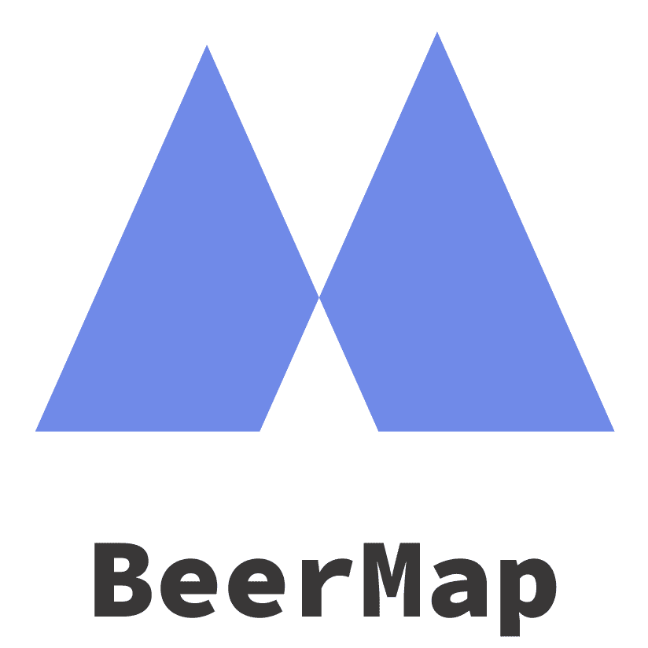

  

# BeerMap

Beer Map est une application web permettant de découvrir des brasseries et des bières sur une carte.

## Utilisation

Avant de pouvoir utiliser l'application, il faut lancer le serveur qui se trouve dans le répertoire parent.

Ensuite, il faut télécharger les librairies nécessaire au projet :
- Nous utilisons `yarn` comme gestionnaire de dépendances.
- Pour télécharger les librairies, tapez `yarn` dans une invite de commande.

Enfin, pour compiler l'application, exécutez `yarn build` dans l'invite de commande.

Une fois la compilation réalisé, vous pouvez accéder à [`http://localhost:3000`](http://localhost:3000).

Pour utiliser notre application, vous pouvez commencer par :
- Faire une recherche d’une ville, d’une bière, d’une brasserie, ou d’une catégorie de bière. 
- Cliquer sur une icône de bière qui s’affiche sur la carte.

Des boîtes s’ouvriront sur l’écran, avec les informations relatives à votre recherche.

Au vu des données qui ne sont pas tout le temps bien remplies nous vous conseillons de faire la recherche des éléments suivants :

- Ville : *London, England* ou *San Francisco, California*
- Bière : *Hardcore IPA* ou *Dragonhead Stout*
- Brasserie : *BrewDog Ltd* ou *Orkney Brewery*
- Catégorie : *North American Ale* ou *British Ale*

Lors d’une recherche de catégorie ou d’une bière, vous ne serez pas amené sur la position géographique de la bière. Cependant vous pouvez cliquer, dans les informations de la bière, sur le nom de la brasserie pour vous déplacer automatiquement sur la carte.

## Points d’entrée

- Récupérer toutes les bières d’une catégorie : *http://127.0.0.1:3000/api/beer/categorie/${id}*
- Récupérer une bière : *http://127.0.0.1:3000/api/beer/brewery/{id}*
- Récupérer toutes les brasseries :  *http://127.0.0.1:3000/api/brewery/*
- Récupérer les brasseries d’une ville : *http://127.0.0.1:3000/api/brewery/city/{name}*
- Récupérer une brasserie : *http://127.0.0.1:3000/api/brewery/id/{id}*

La recherche étant effectuée en websocket, il n’y a pas de points d’entrée pour celle-ci.

## Architecture de l’application

L’application se décompose en deux parties différentes : le serveur et le client. La partie serveur a été développée pour être utilisée en M4105C, elle contient donc un service REST et un websocket.

A la racine du dossier, nous avons ainsi le serveur. Dans le dossier static, nous retrouvons l’application en React JS. Les différents composants de l’interface se trouvent dans le dossier components. Nous y retrouvons :

- BeerCard : Modale utilisée pour afficher les informations d’une bière.
- BreweryBar : Panel affiché à droite de l’écran pour afficher les informations d’une brasserie (nom, adresse, téléphone, site web s’il existe, bières...).
- CategoryBar : Panel affiché à droite pour présenter toutes les bières appartenant à une catégorie.
- CityBar : Panel affiché à gauche pour afficher toutes les informations d’une ville (nom, météo, brasseries).
- SearchBar : Barre de recherche qui s’affiche au-dessus. Dans le dossier Result, se trouvent 4 composants qui permettent l’affichage des résultats de la barre de recherche.

## Choix de développement

Pour réaliser cette application, nous avons utilisé le framework de Facebook nommé React.js. Pour la carte, nous avons utilisé MapBox qui est un service de cartographie. 
Nous avons utilisé git pour sauvegarder les fichiers, et nous avons utilisé Vs Code avec LiveShare pour pouvoir développer en temps réel.

## APIs utilisées 
- Nous avons utilisé notre serveur REST développé pour le cour M4105C.
- Nous avons utilisé OpenWeatherMap pour récupérer la météo des villes.
- Coté serveur, nous avons utilisé ArcGIS pour récupérer la position des villes recherchées.

## WebSocket
Nous avons utilisé des websocket pour la partie recherche de l’application. C’est à dire que l’échange lors d’une recherche entre le serveur et le client se fait en websocket et pour tous les autres appels, il s’agit d’un fetch à l’API REST.

## Auteurs
Ce projet a été réalise par Maxence Leguede, Nathan Rocher, et Josik Sallaud.